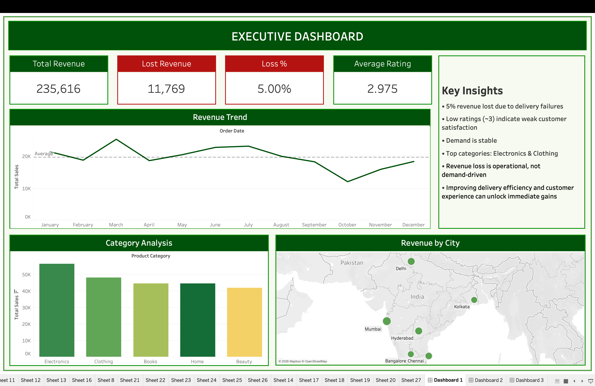

# 📊 E-Commerce Revenue Analytics Dashboard (Tableau)

An interactive **Tableau Dashboard Project** designed to analyze **revenue performance, customer experience, and revenue leakage** in an e-commerce business.  
This project transforms raw transactional data into executive-level insights using KPI cards, trend charts, maps, category analysis, and customer rating intelligence.

---

## 🚀 Project Overview

The dashboard suite consists of **3 executive dashboards**:

### 1️⃣ Executive Dashboard
Provides a high-level summary of:

- Total Revenue
- Lost Revenue
- Loss %
- Average Rating
- Revenue Trend Over Time
- Revenue by Category
- Revenue by City

📌 Focus: Overall business health and operational performance.

---

### 2️⃣ Customer Experience vs Revenue Dashboard

Analyzes how customer ratings impact revenue.

Includes:

- Orders vs Rating Scatter Plot
- Revenue at Risk %
- Revenue Split: Low Ratings vs High Ratings
- Revenue vs Rating Buckets
- Rating Distribution Across Categories

📌 Focus: Customer satisfaction and revenue relationship.

---

### 3️⃣ Revenue Leakage & Failure Analysis Dashboard

Deep dive into failed deliveries and lost revenue.

Includes:

- Category-wise Revenue Loss
- Loss Trend Over Time
- Loss by City
- Loss Rate % by City
- Delivered Revenue vs Lost Revenue

📌 Focus: Operational inefficiencies and revenue recovery opportunities.

---

# 📈 Key Insights

## Executive Dashboard

- ₹235K total revenue generated
- 5% revenue lost due to delivery failures
- Demand remains stable throughout the year
- Electronics & Clothing are top-performing categories

## Customer Experience Dashboard

- 7.68% revenue at risk due to low ratings
- Most revenue comes from 3–4 star ratings
- Delhi & Kolkata show below-average customer experience

## Revenue Leakage Dashboard

- Bangalore has highest revenue loss
- Electronics contributes highest category-level loss (~30%)
- Recent revenue loss spike indicates operational instability

---

# 🛠 Tools Used

- **Tableau Desktop**
- Data Cleaning & Preparation
- Calculated Fields
- KPI Cards
- Heatmaps
- Maps
- Interactive Dashboards

---

# 📂 Dataset Fields Used

- Order ID
- Order Date
- Revenue / Sales
- Delivery Status
- Customer Rating
- Product Category
- City

---

# 🎯 Business Problems Solved

✔ Identify revenue leakage sources  
✔ Measure customer satisfaction impact on sales  
✔ Detect weak-performing cities  
✔ Benchmark product categories  
✔ Support executive decision-making

---

# 📸 Dashboard Preview

## Executive Dashboard

---

# 💡 Future Improvements

- Predictive churn analysis
- AI-based demand forecasting
- Customer segmentation
- Real-time dashboard automation
- Root cause failure detection

---

# 👨‍💻 Author

**Yashvi**  
Aspiring Data Analyst | Tableau | SQL | Python

---

# ⭐ If you like this project, give it a star!